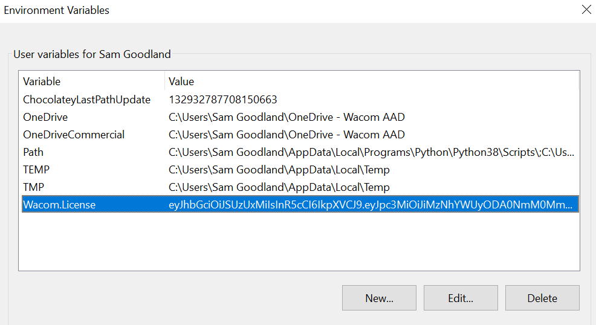
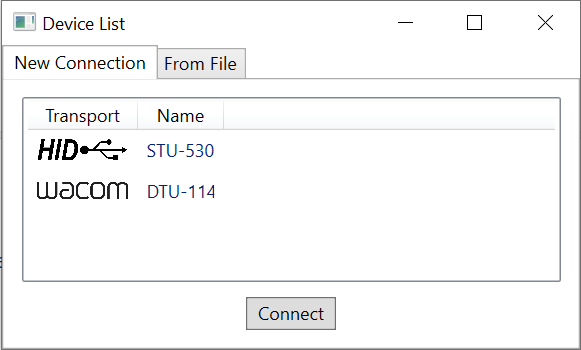
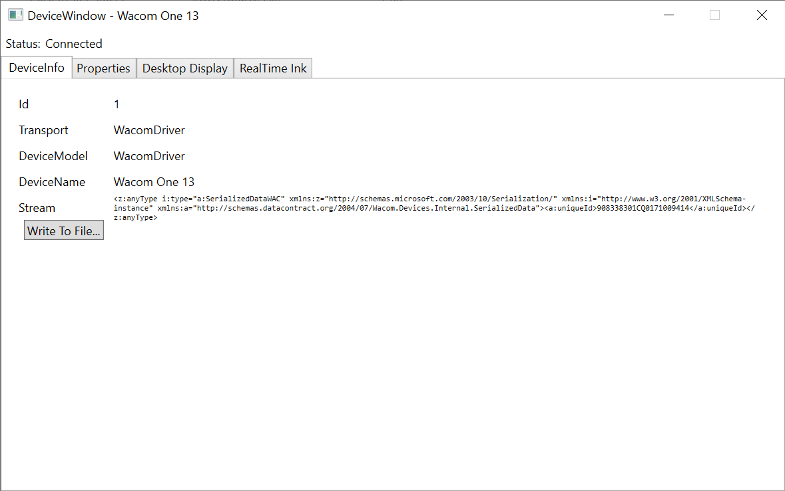
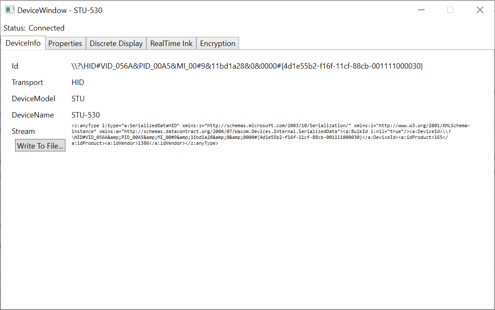
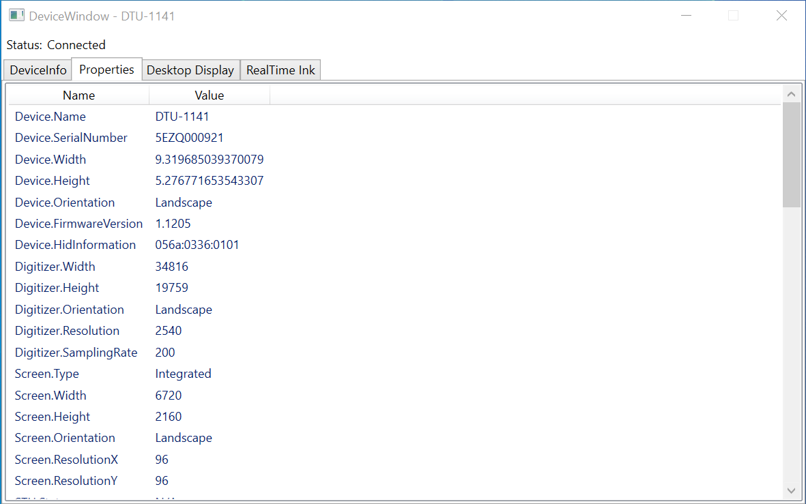
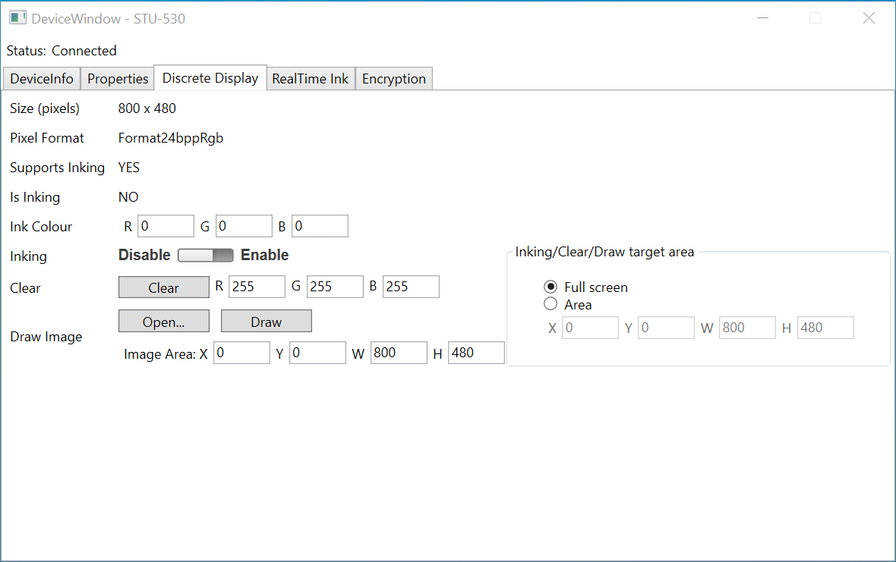
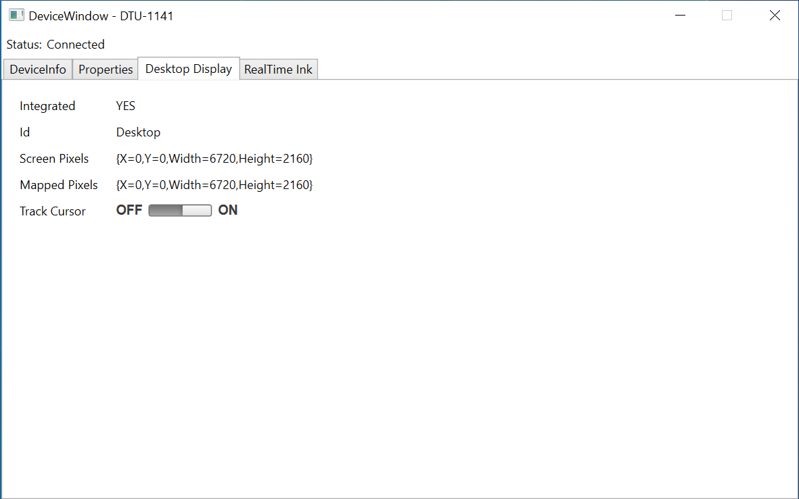
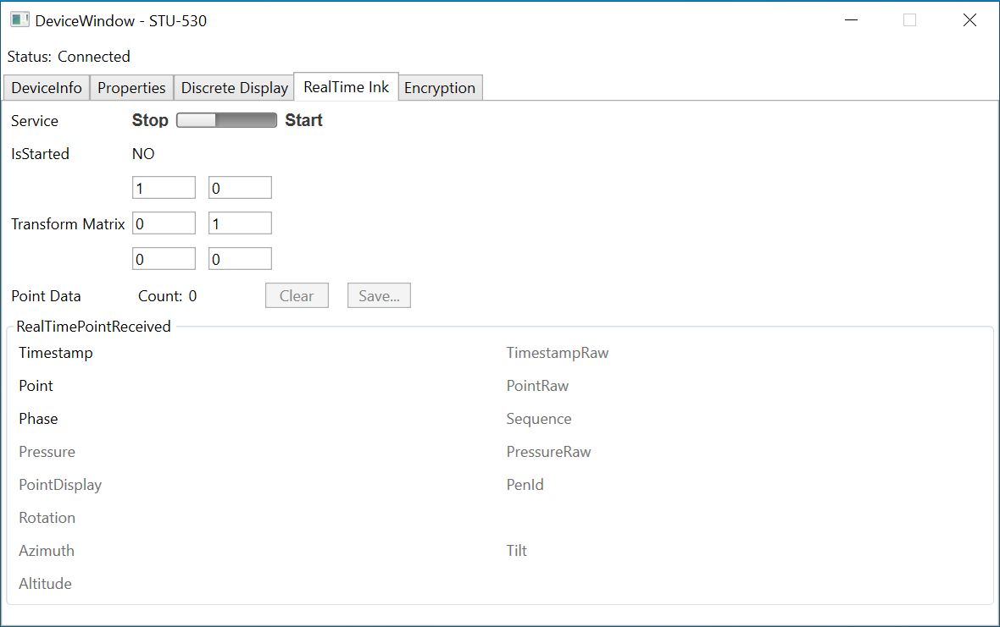
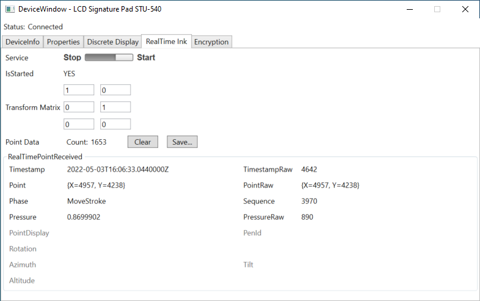
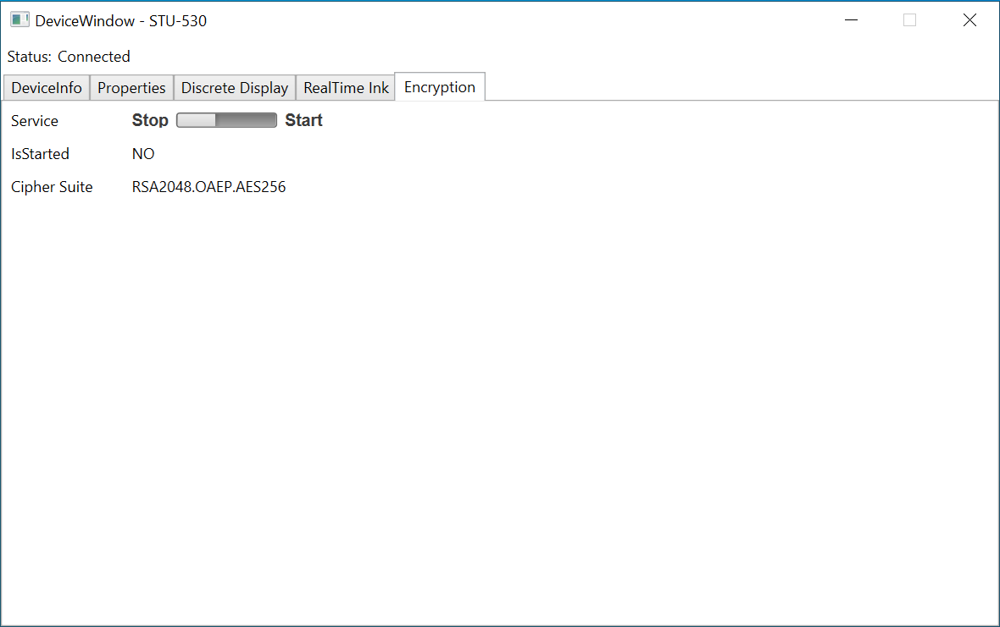

# Getting Started

## Setting up the sample application

The sample has been provided for Windows WPF .NET Core 5.0 To build and run the sample
application you will need Windows 10 with Visual Studio 2019 or above. For example install Visual
Studio Community 2019 Preview with .NET Core and the .NET Framework Developer Pack.

To test the application use a Wacom device such as an STU-430, Bamboo Slate, Folio or PHU-111.
Install Wacom Driver 6.3.42 or higher for Intuos, DTU and Cintiq support. 

## Download the CDL SDK

Unzip the SDK NuGet files (*.nupkg). 

Once the product has been released on DevRel:

- Download the SDK from https://developer.wacom.com/developer-dashboard
- Login using your Wacom ID
- Select Downloads for devices
- Download Wacom Ink SDK for devices for Windows .NET
- Accept the End User License Agreement to use the SDK

The downloaded Zip file contains the SDK Nuget files (*.nupkg).

## Download an evaluation license

If you have not been supplied one, a license string can be requested from signature-support@wacom.com.

Once the product has been released on DevRel:

A license is needed to use the CDL and a fully functional evaluation license is free to
download as follows:

- Navigate to https://developer.wacom.com/developer-dashboard
- login using your Wacom ID
- Select Licenses
- Select New Evaluation License
- Select Generate Evaluation License for Wacom Ink SDK for devices
- Return to Licenses where the new license file is ready for download
- Download the license file

The license is supplied as a JWT text string in a text file. This will need to be copied into your
application. The self-service evaluation licenses have a three-month expiry date from the time of
creation. However you can generate a new license at any time.

An evaluation license can be obtained here:

```
eyJhbGciOiJSUzUxMiIsInR5cCI6IkpXVCJ9.eyJpc3MiOiJiMzNhYWUyODA0NmM0MmE5OTgyY2E1NTdkZjhmY2YxOCIsImV4cCI6MTY4MDUwOTY1MCwiaWF0IjoxNjcyNzM3Mjg5LCJzZWF0cyI6MCwicmlnaHRzIjpbIkNETDJfRU5VTV9VU0IiLCJDREwyX0VOVU1fQkxFIiwiQ0RMMl9FTlVNX1dBQyIsIkNETDJfQkFTSUMiLCJDREwyX1NFUlZJQ0VfUmVhbFRpbWVJbmsiLCJDREwyX1NFUlZJQ0VfRGlzY3JldGVEaXNwbGF5IiwiQ0RMMl9TRVJWSUNFX0Rlc2t0b3BEaXNwbGF5IiwiQ0RMMl9TRVJWSUNFX0ZpbGVUcmFuc2ZlciIsIkNETDJfU0VSVklDRV9FbmNyeXB0aW9uIl0sImRldmljZXMiOlsiV0FDT01fQU5ZIl0sInR5cGUiOiJldmFsIiwibGljX25hbWUiOiJDREwgRXZhbHVhdGlvbiIsIndhY29tX2lkIjoiYjMzYWFlMjgwNDZjNDJhOTk4MmNhNTU3ZGY4ZmNmMTgiLCJsaWNfdWlkIjoiNTY5YWZhMGYtZTc1Zi00YzNmLTg3YzMtNTMzYTE4M2Y5MzE4IiwiYXBwc193aW5kb3dzIjpbXSwiYXBwc19pb3MiOltdLCJhcHBzX2FuZHJvaWQiOltdLCJtYWNoaW5lX2lkcyI6W119.mtop4MGhlhuQ9NOztJK8MBWbIaBNZBQvRcB9cThJhGmSJ8YxSdXcjsyYVWhuEOUD1eubfX7FPnYeBT3uuJ6eUx8WImuVGQboCh3KYz2SX8dXWhyP3LnOr99aadSw3BTZRnPYx9XCk6vjVLn2xLS2Rqg8d45ZECXaeYW_gOHoSvlkqIr_vJqtle82wqmo2IZQckd-n5ijCHh6qHrl9lRI9U12hrhWaj9FO1Ci-xu8UIoq69MCLMfJIho4OfvYC7t73ZY62o50anTQ0GPYjFfnjFJm3OpE2PIaZMJXa5DbWTGgt3sujRxxgEpD5dFtDgQR11qqdih3yNqpXyA_UvKtdg

```

NB: This license is only available for a limited time. 

The license can be added by going into the appropriate CONFIG file and adding the license key in the value field.

```
<?xml version="1.0" encoding="utf-8" ?>
<configuration>
  <appSettings>
    <!-- Add your license key here! -->
    <add key="Wacom.License" value=""/>
 
  </appSettings>
</configuration>
```

The CONFIG files are:

**.csproj sample**

Demo.WPF - app.config

**Pre-built sample**

Demo.WPF - Demo.WPF.dll.config

Alternatively, insert your valid license into your environment variables and title it "Wacom.License". 



## Running the pre-built samples

1.	Copy the pre-built tree to your local system. 
2.	Run the desired program. As most test programs are console programs, it is best to open a command prompt or PowerShell to run them. 

Although all tests should run without crashing, the core new functionality of CDL v2.1 is interaction with Wacom tablets supported by the Wacom Tablet Driver. You will need a tablet driver of at least v6.3.42 to provide support. A reboot is required to fully install the driver. 

## Running the sample from Visual Studio

Install Visual Studio Community 2019 Preview with .NET Core and the .NET
Framework Developer Pack. 

- Download the sample e.g. to C:\CDL
- copy the sdk NuGet files to the NuGet folder. 
  **NB: as the location of the NuGet folder is set within the NuGet Package Manager, its location is up to user preference. By default, it is the nuget folder within the VS sample folder.**
- Open Demo.WPF.csproj in Visual Studio. Add the NuGet folder to the list of Packages Sources in NuGet Package Manager. Build the project. 
- Select CPU type Any CPU.
- Insert the downloaded evaluation license as follows:

```
Open file Demo.WPF\app.config
  
Insert the license string in value:
```

- Select Build... Rebuild Solution
- Set Demo.WPF as the Startup Project in Solution Explorer

## Using the Demo.WPF

2.1.0.11 of CDL introduced a new pre-built demo app structured differently to the old Sample.WPF. This section will cover how to use the new demo's
interface.

Upon launching the demo, a list of currently connected devices will appear. Select one and press Connect to use the selected device.



This will prompt a new window that features a series of tabs, depending on the device currently plugged in. For example, below are the tabs available when a Wacom One is plugged in:



#### DeviceInfo

DeviceInfo covers details of the connected device, such as how information is transported, the device model and its ID.



Pressing "Write to File..." at the bottom will export the Stream data and save it to a .Stream file. 

#### Properties

Properties contains information more technical than what is contained within DeviceInfo, such as screen dimensions & resolutions, the device's default mode and orientation of the device. 



#### Discrete Display

When plugging in a device such as an STU, the Discrete Display tab will be available as an option. 



The user is given control over ink and background colour, drawing on the canvas, adding a background with Open... and Draw, which select and apply an image to the canvas respectively. 

#### Desktop Display

If using a device such as a WacomOne or DTU, the Desktop Display tab will be available as an option.



From here, the user will be able to toggle cursor tracking on the device. They will also be displayed information on whether or not the display is integrated, its ID and both its screen and mapped pixels. 

#### RealTime Ink

RealTime Ink will show ink data received by the device at a given point. By default, the service will be deactivated.



Setting Service to "Start" will enable the tracking and display of ink data. 



Placing the pen on the screen will feed in information such as the timestamp, co-ordinates and pressure of the most recently received pen data and display it in the RealTimePointReceived section. 

Adjusting the values of the transform matrix will affect the displayed Point values within RealTimePointReceived.

Pressing Clear will remove the current data contained within RealTimePointReceived.

Pressing Save... will save the current data as a CSV file which may be later accessed in Excel.

#### Encryption

The Encryption tab can be used to toggle encryption on the given device. Starting the service below in the Service section will activate it. 



## API Reference

Once the project has installed the SDK NuGet packages the API can be viewed through IntelliSense or Object Browser in Visual Studio.