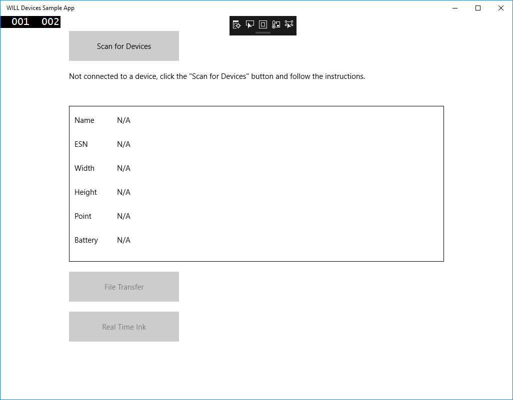

# Getting Started 

## Test environment

The sample has been provided for the Universal Windows Platform (UWP).
To build and run the sample application you will need Windows 10 with Visual Studio 2017 or above.

To test the application use a Wacom device such as a Bamboo Slate, Folio or PHU-111.

## Download the CDL SDK

Download the SDK from https://developer.wacom.com/developer-dashboard

* login using your Wacom ID
* Select **Downloads for devices**
* Download **CDL for Windows 10 (UWP)**
* Accept the End User License Agreement to use the SDK

You will also need the WILL SDK for ink:

* Under WILL SDK for Ink: Download WILL SDK for Windows 10 (UWP)


The downloaded Zip file contains the SDK with documentation.
The folder 'Sdk' is included in the Zip file and is needed to build the sample.

## Download an evaluation license

A license is needed to use the CDL and a fully functional evaluation license is free to download as follows:

* Navigate to https://developer.wacom.com/developer-dashboard
* login using your Wacom ID
* Select **Licenses**
* Select **New Evaluation License**
* Select **Generate Evaluation License** for Wacom Ink SDK for devices
* Return to Licenses where the new license file is ready for download
* Download the license file

The license is supplied as a JWT text string in a text file. This will need to be copied into your application. The self-service evaluation licenses have a three-month expiry date from the time of creation. However you can generate a new license at any time. 


## Build the sample application

Download the sample application folder WillDeviceSampleApp e.g. to C:\CDL

First install the Visual Studio .vsix extensions in the order:

* Sdk\Will.Ink.vsix         - (NOTE: This extension is included in the WILL SDK for ink - Windows UWP - v2.0.1, 5 March 2018)
* Sdk\Will.Devices.vsix     - (NOTE: This extension is included in the Download CDL SDK for Windows  - v1.0.1, 5 March, 2018)

To install each extension double-click the file and follow the Install options (defaults).

> **Note:** to use the extensions in a new Visual Studio project:
>
>    Create New…Project…Visual C#..Windows..Universal..Blank App (Universal Windows)
>    In the Solution Explorer, right-click References
>    Add Reference
>      Universal Windows…Extensions
>      Select and check the installed WILL extensions

Build the sample:

* Open WillDevicesSampleApp.sln in Visual Studio
* If prompted select Developer Mode in Settings
* Select CPU type x86
* Insert the downloaded evaluation license as follows:
    * Open file App.xaml.cs
    * Insert the license string in the statement
      ```
      static readonly string license = "<<license>>";
      ```
* Select Build... Rebuild Solution
      
Run the application to display the main window:



* Connect a suitable Wacom device to the PC - for example a Bamboo Slate, Folio or PHU-111 Clipboard
* Click [Scan for Devices]
* A list of available devices will be displayed
* Select the device name to connect to the CDL device 
* Select [Real Time Ink] to display the pen trace in real-time.

----

        


