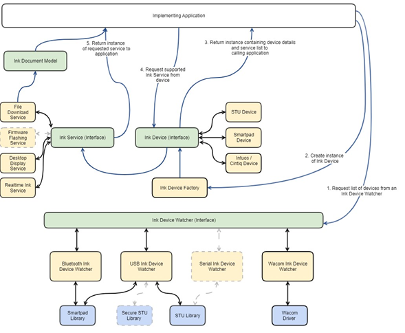

# Wacom Ink SDK for devices for Windows 

> **NB: This series of Wacom products is now discontinued and support for them is no longer offered.** 

## Introduction

The Wacom Ink SDK for Devices acts as the bridge between hardware that is capable of capturing digital inking data, and our ink software ecosystem. The data that is produced by the Wacom Ink SDK for Devices can be used with Wacom Wacom Ink SDK for Ink libraries for lifelike rendering, although it should be noted that this library has no direct dependency on the Wacom Ink SDK for Ink.

**NB: The Wacom Ink SDK for Devices is sometimes referred to as the Common Device Library or CDL.**

The SDK has four simple core concepts:

- Ink Device Watcher
- Ink Device Factory, which creates an Ink Device with any number of
  - Ink Services
  - Ink Notifications

Each of these is defined as an abstract interface which a number of concrete instances implement and extend on. The basic idea is that an Ink Device Transport Manager is used to scan for and connect to a specific Ink Device. An Ink Device provides one or more Ink Services and Ink Notifications that serve a specific digital ink or device related service. Note that the license module is absent from the diagram for the sake of clarity, but is required in the concrete designs. Future additions are shown in grey:



The **Ink Device Transport Manager** is used to scan for and connect to a specific Ink Device. An Ink Device provides one or more Ink Services and Ink Notifications that serve a specific digital ink or device-related service.

## Ink Device Watcher

```
public interface Wacom.Devices.IInkDeviceWatcher
{
  void Start();
  void Stop();

  event EventHandler<IInkDeviceInfo> DeviceAdded;
  event EventHandler<IInkDeviceInfo> DeviceRemoved;
}
```

The Ink Device Watcher is an interface which is implemented by all types of connections and provides a list of all devices that are available for use via that particular transport.

The application that is using the library will instantiate a particular instance from InkDeviceWatcher to provide the hardware interface they are interested in.

```
public static class Wacom.Devices.InkDeviceWatcher
{
  public static IInkDeviceWatcherUSB USB { get; }
  public static IInkDeviceWatcherBLE BLE { get; }
  public static IInkDeviceWatcherBTC BTC { get; }
  public static IInkDeviceWatcherWAC WAC { get; }
}
```

If the implementing application is to enumerate two connection types (e.g. Bluetooth and USB), it's required to instantiate multiple watchers and aggregate the results manually. The ink device watcher returns a list of InkDeviceInfo that will be available for connection. This can be provided to the Ink Device Factory to connect to a particular InkDevice.

The InkDevice types returned by the watcher are serialisable to enable an application to store previously known devices for connection at a later date.

```
public interface Wacom.Devices.IInkDeviceInfo : INotifyPropertyChanged
{
    string Id { get; }
    TransportProtocol TransportProtocol { get; }
    DeviceModel DeviceModel { get; }
    string DeviceName { get; }
    void ToStream(Stream stream);
}
```

When the library user completes the device connection routine with a selected device presented by the manager, an instance of an InkDeviceInfo will be returned.

```
public static class Wacom.Devices.InkDeviceInfo
{
    public static async Task<IInkDeviceInfo> FromStreamAsync(Stream stream);
}
```

### USB Devices

The USB Device Watcher is responsible for presenting the user with all ink input devices that are connected directly via the USB interface and does not need any other driver installed. This includes smart pad devices (e.g Viper, PHU-111) and STU devices (e.g STU-540).

### Bluetooth Devices

The Bluetooth Device Watcher is responsible for presenting the user with a list of all ink input devices that can be seen via the BTLE and BTC interfaces. **NB: this support will be limited to Window 10 only**.

The Bluetooth device manager should also provide a callback interface to enable the connection and pairing events that are particular to Bluetooth devices such as user device confirmation requirements.

### Wacom Devices

The Wacom Device Watcher is responsible for presenting the user with a list of all ink input devices that are provided by the Wacom Device Driver. This includes access to our Intuos pads via the driver, the Windows ink system or a touch interface that is exposed on the device.

## Ink Devices

An Ink Device is an interface that contains methods which detail a specific device's characteristics such as capture size, sample rate, device ID and pen ID. This interface also provides access to the Ink Services that the particular instance of the device. Any given ink device valid to be supported will support the Ink Device interface. The Ink Device can also enable the user to set and get device specific properties such as name or system parameters.

### Smartpad Devices

The Smartpad Device is used to cover the range of Wacom smartpad devices. Typically, smart pad devices provide a number services including real time ink and file download. In addition to the provided Ink Services, the smart pad device also has a number of asynchronous events that the library user can register for such as battery events or barcode scan events.

### STU Devices

The STU device covers the standard (non 541) range of STU devices. These devices support a number of services such as real time inking for data capture, discrete display device file (image) upload.

### Realtime Inking Service

The realtime inking service is used to gather streaming point or ink data from a device. This data is delivered in a standard format (e.g. x,y,p,t,tilt,azimuth,rotation) with a number of events such as:

- Stroke started (pen down)
- Stroke moved
- Stroke ended (pen up)
- Hover point (proximity move)
- Proximity entered
- Proximity exited

An implementing application will register against these callbacks to receive the ink data. This should also return the pen ID the point is related to if the information is available for the device.

### Discrete Display Service

This provides the mechanism for manipulating a screen that is not regarded as a monitor, such as an STU display.

### Desktop Display Service

This provides the details of any tablet that is mapped to the desktop display monitor. This includes dedicated devices such as the Cintiq range where there is a one-to-one mapping, or Intuos range where the tablet is often mapped across the whole desktop.

## File Download Service

The file download service is used to pull saved data from a device. This is presented in a simplified form; there is no dependency made to WILL Ink/Document formats but it is easily convertible.

### Part 1 - Enumeration, scanning and selection.

The pattern continued and extended from the original CDL1. The existing USB class is extended to provide enumeration for STU tablets, along with the associated STU bulk interface.

```
  /// <summary>
  /// Implemented by classes that are used to enumerate dynamically Wacom
digital ink devices.
  /// The application receives notifications whenever devices are added,
removed or changed.
  /// </summary>
  public interface IInkDeviceWatcher
  {
      /// <summary>
      /// Starts the device watcher.
      /// </summary>
      void Start();

      /// <summary>
      /// Stops the device watcher.
      /// </summary>
      void Stop();

      /// <summary>
      /// Occurs when a Wacom digital ink device is added.
      /// </summary>
      event EventHandler<IInkDeviceInfo> DeviceAdded;

      /// <summary>
      /// Occurs when a Wacom digital ink device is removed.
      /// </summary>
      event EventHandler<IInkDeviceInfo> DeviceRemoved;
  }

  /// <summary>
  /// Dynamically enumerates Wacom digital ink devices that use the USB
protocol.
  /// The application receives notifications whenever devices are added,
removed or changed.
  /// </summary>
  ///
  public static class InkDeviceWatcher
  {
      public static IInkDeviceWatcherUSB USB;
      public static IInkDeviceWatcherBLE BLE;
      public static IInkDeviceWatcherBTC BTC;
      public static IInkDeviceWatcherWAC WAC;
  }
```

The starting point for the applications is the use of a specific family of InkDeviceWatcher. These
provide a standardised way of enumerating devices and listening to connect and disconnect
events. Although they all share a base class, the bluetooth interface is extended in order to
handle connection authentication.

### Part 2 - Device Creation

Once a device has been selected for use, the IInkDeviceInfo object is passed to the
InkDeviceFactory for creation. The object can be serialised and restored for use at a later stage.

This single class can handle all types of device.

```
public class InkDeviceFactory
{
  private InkDeviceFactory();

  public static readonly InkDeviceFactory Instance = new InkDeviceFactory();

  public async Task<IDigitalInkDevice> CreateDeviceAsync(IInkDeviceInfo info,
  CancellationToken ct);

  public async Task<IDigitalInkDevice> CreateDeviceAsync(IInkDeviceInfo info,
  IApplicationIdentifier appId, bool authorize, bool enableEncryption,
  EventHandler<DeviceStatusChangedEventArgs> deviceStatusChangedHandler,
  PairingModeEnabledCallback pairingModeEnabledCallback = null)
}
```

### Part 3 - Device Use

Connecting to a device provides the IDigitalInkDevice object which is a device independent interface for any type of tablet.

```
public interface Wacom.Devices.IDigitalInkDevice : IDisposable
{
  Task<object> GetPropertyAsync(string propertyName, CancellationToken ct);
  Task SetPropertyAsync(string propertyName, object value, CancellationTokenct);

  IInkDeviceService GetService(string serviceId);
  IInkDeviceNotification<T> GetNotification<T>(string notificationId) where T: EventArgs;

  void Close();

  DeviceModel DeviceModel { get; }
  TransportProtocol TransportProtocol { get; }

  event EventHandler Disconnected;
}
```

All devices are reduced to a simple set of abstract operations:

- Get/Set Properties
- Services
- Notifications

There are also a few ancillary operations for querying the device type and transport used. All
operations are keyed by string.

### Properties

All devices have a basic set of properties (for example, tablet width/height) while extensions can
be provided for device-specific features (such as number of cursors supported). All the features
are contained and documented in Wacom.Devices.Properties namespace. Common features are
specifically held within Wacom.Devices.Properties.Devices and Wacom.Devices.Properties.Screen.

### Services

Note that services are not disposable and requesting the service multiple times will result in the
same object being returned each time. Services are dependent (via weak reference) upon the
InkDevice object which is disposable. Once an InkDevice is disposed, all services (and
notifications) are logically removed.

The primary service is the RealTimeInk service. This provides stylus data in real time. This is
provided for all tablets.

Additionally, for STU tablets, services are provided for controlling its dedicated display and
encryption. For SmartPad devices, services are available to retrieve documents and bluetooth
pairing. Most other tablets are mapped to the desktop. The DesktopDisplayService describes this
mapping.

### Notifications

Notifications are provided for events other than disconnected which is explicitly defined.
Notifications are for device specific events such as battery status, or physical button detection.

## Interaction Tables for STU Tablets:

The STU range of tablets is unusual in that it operates a discrete display that automatically
renders a trace of the stylus during contact. If this is used with applications that are unaware of
this display CDL attempts to intelligently guess when to clear the display so that it preserves user
privacy and reuse.

The following tables therefore describe how CDL operates the STU when an application has only
requested a subset of services. The actions cater for the states:

- Start service
- Deferred - period with no pen activity (pen timeout)
- Stop Service
- Dispose Service

### Real Time Ink Service

<table class="table table-bordered table-hover table-condensed">
<thead><tr><th title="Field #1">RTS</th>
<th title="Field #2">IDigitalDevice RTS</th>
<th title="Field #3">IDigitalDevice RTS IDiscreteDisplay</th>
<th title="Field #4">IDigitalDevice RTS IEncryption + EncryptionDisabled</th>
<th title="Field #5">IDigitalDevice RTS IEncryption + EncryptionEnabled</th>
<th title="Field #6">IDigitalDevice RTS IDiscreteDisplay IEncryption (enable or disabled)</th>
</tr></thead>
<tbody><tr>
<td>RTS Start</td>
<td>if (deferred pending)&lt;br/&gt;{ ClearScreen } EnableInking</td>
<td>no operation</td>
<td>as per IDigitalDevice only</td>
<td>if (deferred pending)&lt;br/&gt;{ DisableEncryption ClearScreen EnableEncryption } EnableInknig</td>
<td>no operation</td>
</tr>
<tr>
<td>RTS Stop</td>
<td>DisableInking&lt;br/&gt;set deferred</td>
<td> no operation	</td>
<td>as per IDigitalDevice only</td>
<td>DisableInking set deferred</td>
<td>no operation</td>
</tr>
<tr>
<td><br/>(deferred)</td>
<td>ClearScreen</td>
<td> no operation	</td>
<td>as per IDigitalDevice only</td>
<td>	DisableEncryption&lt;br/&gt; ClearScreen EnableEncryption	</td>
<td>no operation</td>
</tr>
<tr>
<td>(RTS Dispose)</td>
<td>if (deferred pending)&lt;br/&gt;{ ClearScreen }</td>
<td> no operation	</td>
<td> as per IDigitalDevice only	</td>
<td>if (deferred pending)&lt;br/&gt;{ DisableEncryption ClearScreen }</td>
<td>no operation</td>
</tr>
</tbody></table>

### Discrete Display Service

<table class="table table-bordered table-hover table-condensed">
<thead><tr><th title="Field #1">DDS</th>
<th title="Field #2">IDigitalDevice DDS</th>
<th title="Field #3">IDigitalDevice DDS RTS + Disabled</th>
<th title="Field #4">IDigitalDevice DDS RTS + Enabled</th>
<th title="Field #5">IDigitalDevice DDS IEncryption + EncryptionDisabled</th>
<th title="Field #6">IDigitalDevice DDS IEncryption + EncryptionEnabled</th>
<th title="Field #7">IDigitalDevice DDS IEncryption + EncryptionEnabled RTS + Stopped</th>
<th title="Field #8">IDigitalDevice DDS IEncryption + EncryptionEnabled RTS + Started</th>
</tr></thead>
<tbody><tr>
<td>EnableInking</td>
<td>EnableInking</td>
<td>EnableInking</td>
<td>EnableInking</td>
<td>EnableInking</td>
<td>EnableInking</td>
<td>As previous</td>
<td>EnableInking</td>
</tr>
<tr>
<td>DisableInking</td>
<td>DisableInking</td>
<td>DisableInking</td>
<td>DisableInking</td>
<td>DisableInking</td>
<td>DisableInking</td>
<td>As previous</td>
<td>DisableInking</td>
</tr>
<tr>
<td>ClearScreen or DrawImage</td>
<td>ClearScreen</td>
<td>ClearScreen</td>
<td>RTS Stop, ClearScreen, RTS Start</td>
<td>ClearScreen</td>
<td>ENC stop, ClearScreen, ENC start</td>
<td>As previous</td>
<td>RTS Stop, DisableInking, ENC Stop, ClearScreen, ENC Start, EnableInking, RTS Start</td>
</tr>
</tbody></table>

### Encryption Service

| ENC       | IDigitalDevice <br>ENC | IDigitalDevice <br>ENC <br>RTS (Stopped) | IDigitalDevice <br>ENC <br> RTS (Started)                                       | IDigitalDevice <br>ENC<br> DDS                                                    | IDigitalDevice <br>ENC<br> DDS <br>RTS (Started)                                 |
| --------- | ---------------------- | ---------------------------------------- | ------------------------------------------------------------------------------- | --------------------------------------------------------------------------------- | -------------------------------------------------------------------------------- |
| ENC Start | ENC Start              | ENC Start                                | RTS Stop <br> (DisableInking) <br> ENC Start <br> (EnableInking) <br> RTS Start | RTS Stop <br> (DisableInking) <br> ENC Start <br> (restore Inking) <br> RTS Start |                                                                                  |
| ENC Stop  | ENC Stop               | ENC Start                                | RTS Stop <br> (DisableInking) <br> ENC Stop <br> (EnableInking) <br> RTS Start  | ENC Stop                                                                          | RTS Stop <br> (DisableInking) <br> ENC Stop <br> (restore Inking) <br> RTS Start |


# Additional resources 

## Sample Code
For further samples check Wacom's Developer additional samples, see [https://github.com/Wacom-Developer](https://github.com/Wacom-Developer)

## Documentation
For further details on using the SDK see [Wacom Ink SDK for devices documentation](https://developer-docs.wacom.com/docs/overview/sdks/sdk-for-devices/) 

The API Reference is available directly in the downloaded SDK.

## Support
If you experience issues with the technology components, please see related [FAQs](https://developer-support.wacom.com/hc/en-us)

For further support file a ticket in our **Developer Support Portal** described here: [Request Support](https://developer-support.wacom.com/hc/en-us/requests/new)

## Developer Community 
Join our developer community:

- [LinkedIn - Wacom for Developers](https://www.linkedin.com/company/wacom-for-developers/)
- [Twitter - Wacom for Developers](https://twitter.com/Wacomdevelopers)

## License 
This sample code is licensed under the [MIT License](https://choosealicense.com/licenses/mit/)

---